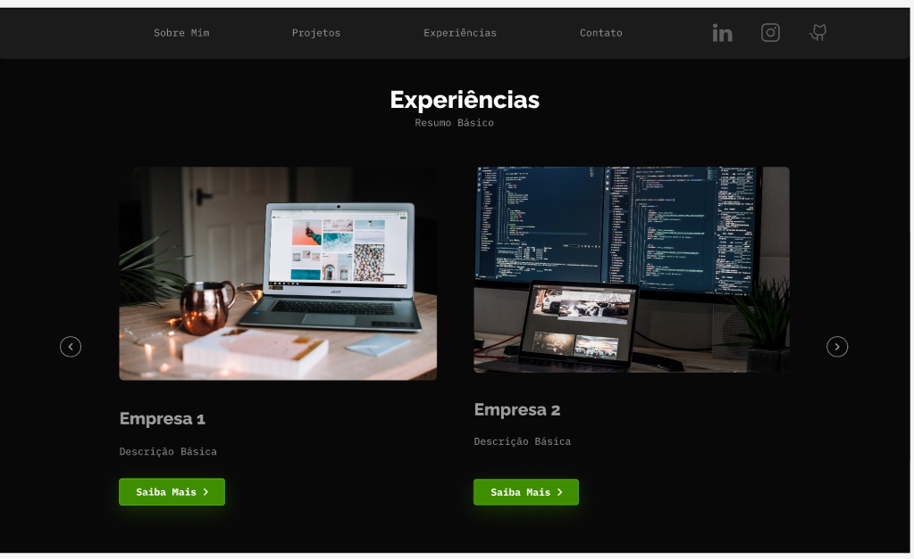
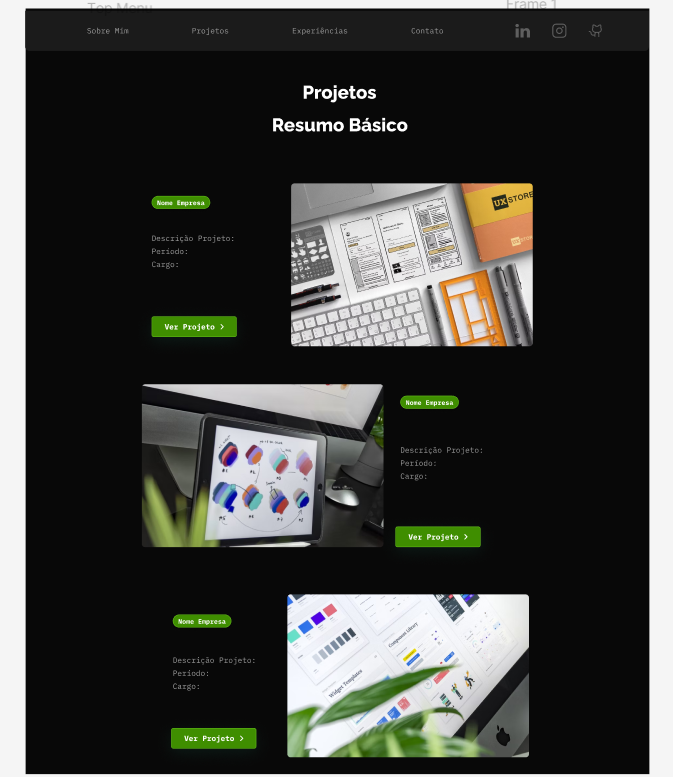
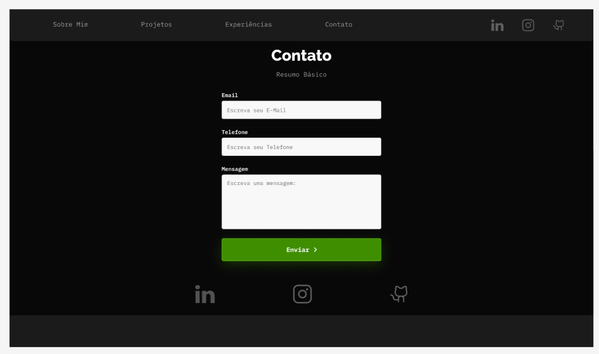
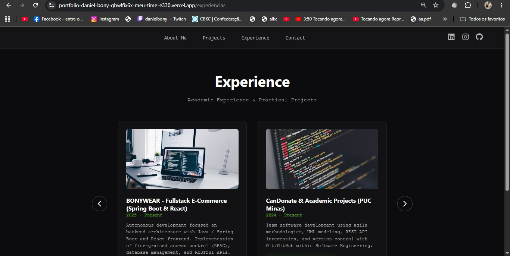
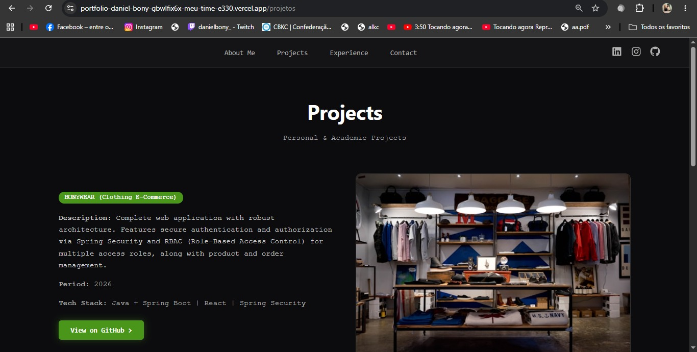
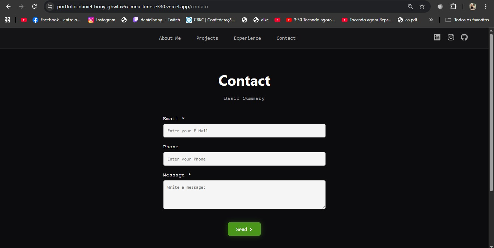

# portfolio-daniel-bony

Sobre mim: 

Meu nome é Daniel Bony, tenho 19 anos de idade. Estou no quarto período da faculdade cursando Engenharia de Software.


# Portfólio Pessoal

> *Portfólio web - Daniel Bony*

---

## 📌 Descrição do Projeto

Esse

* **Objetivo:** Criar uma plataforma web para organizar e deixar a mostra minhas habilidades de programação e desenvolvimento
* **Público-alvo:** Recrutadores

---

## 🎨 Protótipos

Aqui estão as imagens das telas e do fluxo da aplicação:

### 📱 Layout / Telas






> 🔗 **Link do Figma:** (https://www.figma.com/design/e4Malif4A6em6Vo9LXrWvZ/Untitled?node-id=0-1&t=WITG0Hr00AYAHLcq-1)


### PROJETO EM EXECUÇÃO DEPLOYADO







---

## 🛠️ Tecnologias Previstas

* **Front-end:** React.js, JavaScript (ES6+), HTML5, CSS3 / Vite
* **Navegação & Roteamento:** React Router DOM
* **Design & Prototipação:** Figma
* **Versionamento & Deploy:** Git, GitHub e Vercel / Render

---

## 📁 Estrutura Inicial do Site

```text
nome-do-repositorio/
├── assets/
│   ├── images/
│   └── icons/
├── css/
│   └── style.css
├── js/
│   └── script.js
├── index.html
└── README.md

